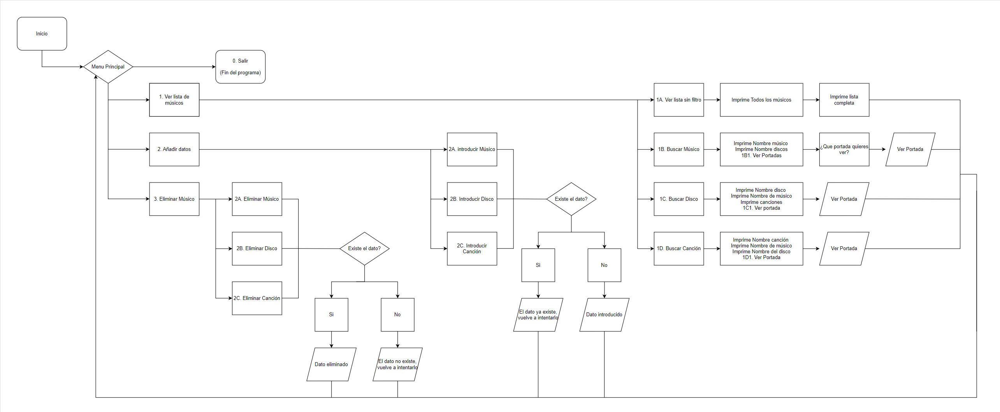
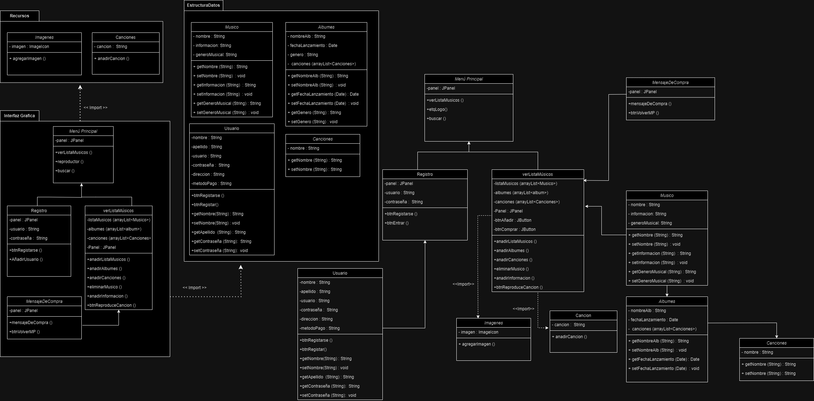
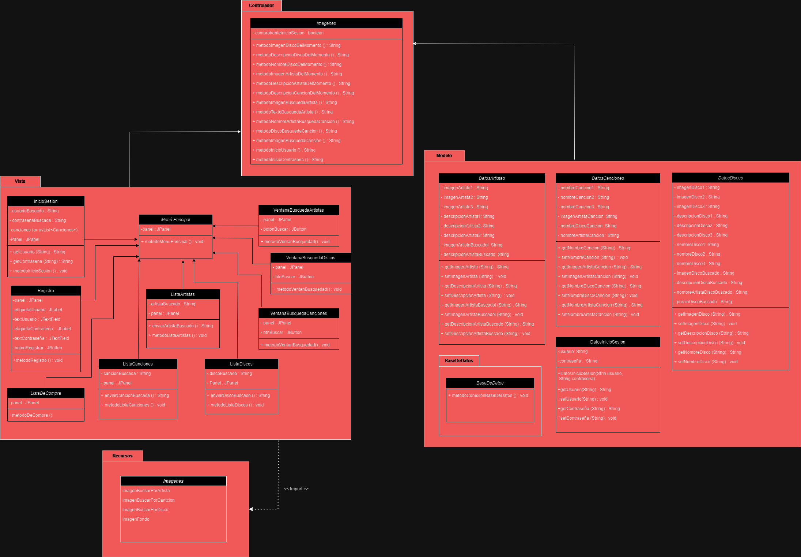

# FUNKYTOWN INC.
Esta aplicación titulada "FunkyTown Inc." es un proyecto de fin de curso confeccionado por Nicolás Viéitez Domínguez y Susana Santos Mallqui para el ciclo superior de "Desarrollo de Aplicaciones Multimedia", comumente conocida como DAM.

En este ReadMe incluirá de manera resumida el proceso del proyecto y todos los pasos que se han dado desde la creación de la idea hasta el completo funcionamiento del programa.

## Primera fase: Desarrollo de la idea.
La primera fase consistió en desarrollar y pensar la idea que formará todo el programa, desde un primer momento se vió una clara preferencia por la temática musical y desde ese gusto compartido surgió la idea del programa en sí.

El programa desde un punto de vista teórico consistía en crear un "Historico" de grupos y músicos donde podrías ver una lista de diferentes artistas junto a su discofrafía además de introducir y eliminar tus propios datos.

Además de lo anteriormente mencionado, la idea también incluía introducir imágenes para las portadas.

## Segunda fase: Creación del diagrama de flujo.
Una vez desarrollada la idea se hizo un diagrama de flujo donde quedaba reflejada la funcionalidad del programa de manera visual y básica.

A continunación se puede ver el primer diagrama de la aplicación:

## Tercera fase: Codificamos el programa.
Empezamos con la codificación del programa, creando las clases que tengan los datos de usuario, artistas, discos, canciones. Según a lo que tenemos en el diagrama. Vamos creando por carpetas: 
  - Recursos, donde van las imagenes.
  - Interfaz Gráfica, donde va la interfaz que maneja el usuario.
  - Estructura de datos, donde van los datos de usuarios, artistas, discos, canciones.
Esto es lo que inicialmente creamos, pero luego según a la rubrica modificamos el código ssegun a los siguientes diagramas para cumplir con la arquitectura MVC.

Esto nos lleva a modificar el código, refactorizando las clases, y modificando los nombres de carpetas. También añadimos la base de datos en otra carpeta nueva junto a una libreria con el punto jar de java para conectarla. Luego cambiamos los nombres de las carpetas:
  - Controlador, controla la view y lo comunica con el modelo.
  - Modelo, maneja dentro la base de datos.
  - Vista, aqui va toda la interfaz con la que interactura el usuario.

